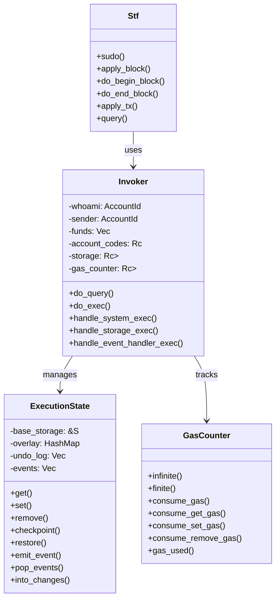
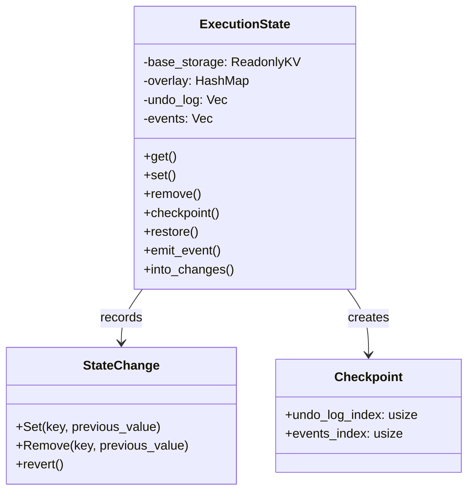
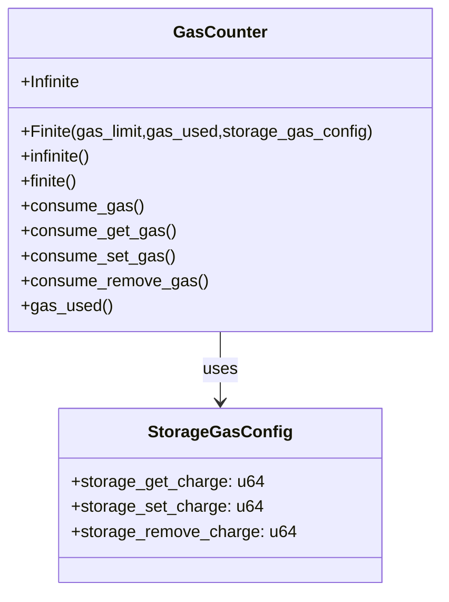
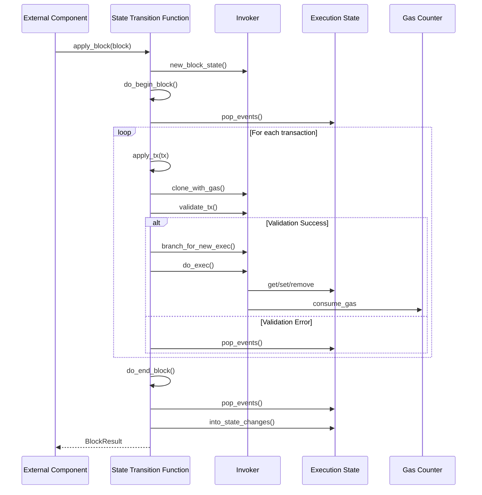
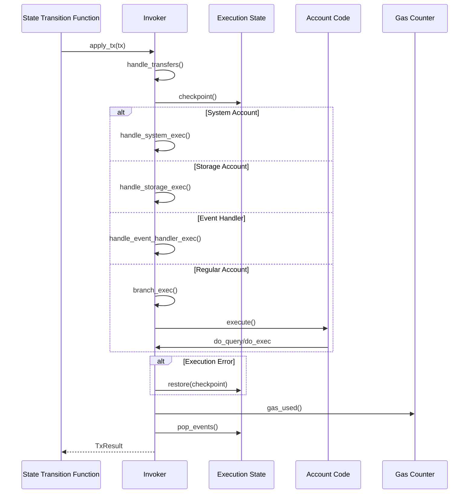
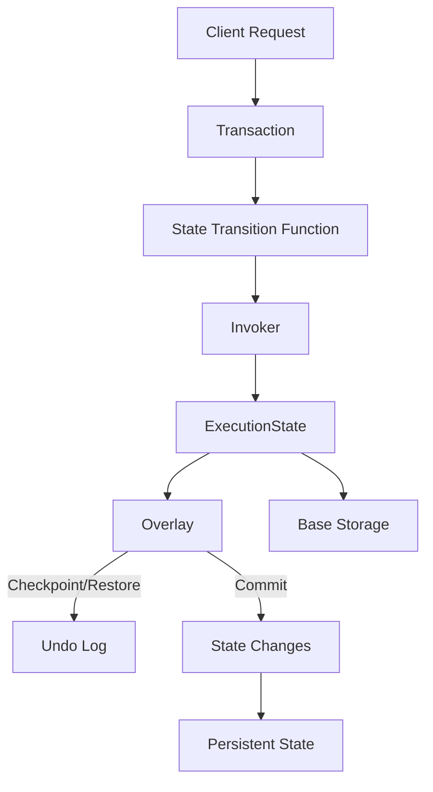
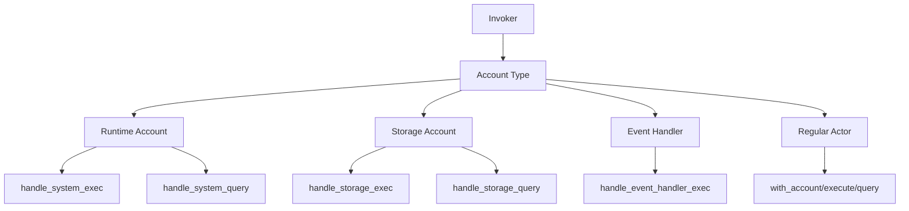
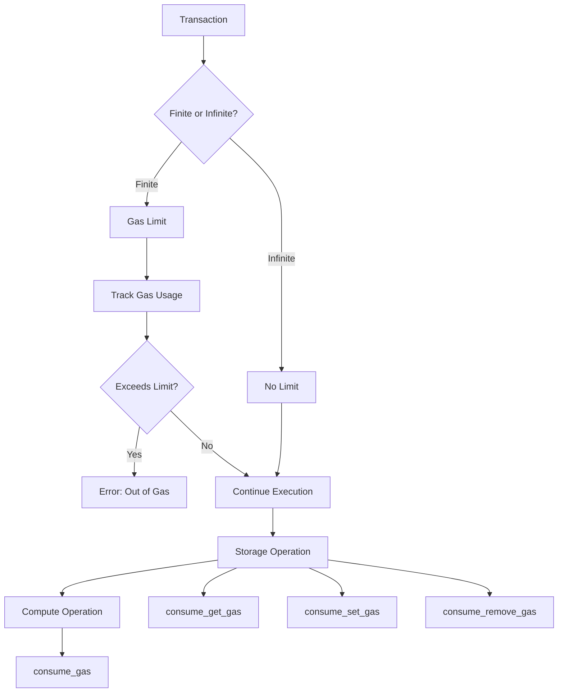
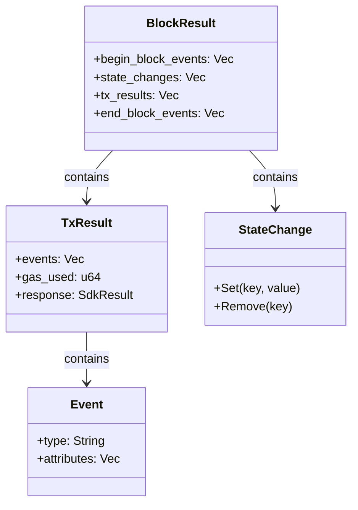

# Application Actor System Documentation

## Overview

The Application Actor system is a component of the CoTend/Evolve runtime that handles the execution of transactions,
state management, and the actor model implementation. This document explains the architecture, components, and flow of
the system.

## Core Components

### State Transition Function (STF)

The STF is the central component that orchestrates the execution of transactions and manages the state of the
blockchain. It provides functions for:

- Applying blocks (`apply_block`)
- Executing transactions (`apply_tx`)
- Managing block lifecycle (`do_begin_block` and `do_end_block`)
- Executing queries (`query`)
- Running privileged operations (`sudo`)

### Execution State

The ExecutionState provides an abstraction over the blockchain's state with features for:

- Reading and writing state (`get`, `set`, `remove`)
- Creating checkpoints for transactional execution
- Rolling back state changes if needed
- Tracking emitted events

### Gas System

The GasCounter tracks and enforces resource usage limits during execution:

- Infinite mode for system operations
- Finite mode for user transactions
- Configurable gas costs for different operations

### Invoker

The Invoker acts as an execution environment for actors in the system:

- Manages identity (`whoami` and `sender`)
- Tracks funds being transferred
- Provides access to storage and gas accounting
- Handles special system accounts

## Execution Flow

### Block Execution Flow

### Transaction Execution Flow

## Storage and State Management

The system uses a layered approach to state management:

1. **Base Storage**: Persistent blockchain state (immutable within a transaction)
2. **Overlay**: In-memory overlay of changes made during execution
3. **Undo Log**: Record of changes for potential rollback

## Special Account Types

The system has special system accounts that handle core functionality:

1. **Runtime Account**: Handles system operations like account creation
2. **Storage Account**: Provides storage operations to actors
3. **Event Handler**: Manages event emission and processing

## Gas Model

The gas system ensures resource usage is properly accounted for:

## Results and Event Handling

The system produces structured results from execution:

## Conclusion

The Application Actor system provides a robust framework for executing transactions, managing state, and enforcing
resource limits in the CoTend/Evolve blockchain. Its modular design with the STF, Invoker, ExecutionState, and
GasCounter components enables secure and efficient execution of smart contracts in an actor-based model.
